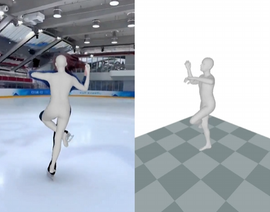
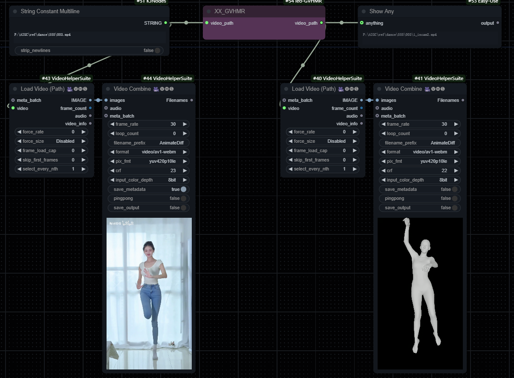

# Unoffice Hamer-ComfyUI by leo 
base on [GVHMR](https://github.com/zju3dv/GVHMR) ,基于此项目  
  
  

Local video smpl model inference, which only supports video, not single image, can be used in pose-driven animation tools such as [champ](https://github.com/fudan-generative-vision/champ) and [RealisDance](https://github.com/damo-cv/RealisDance)  
本地视频smpl模型推理，仅支持视频，不支持单图，可用于champ, RealisDance等姿势驱动动画工具  
  
* workflows/工作流  
The usage is simple, please refer to the workflow file  
用法简单，可参考workflows文件夹下的工作流文件  
  
## 安装  
Installation and models download, please referred to [GVHMR](https://github.com/zju3dv/GVHMR)  
相关模型下载及依赖，可参考[GVHMR](https://github.com/zju3dv/GVHMR)  
